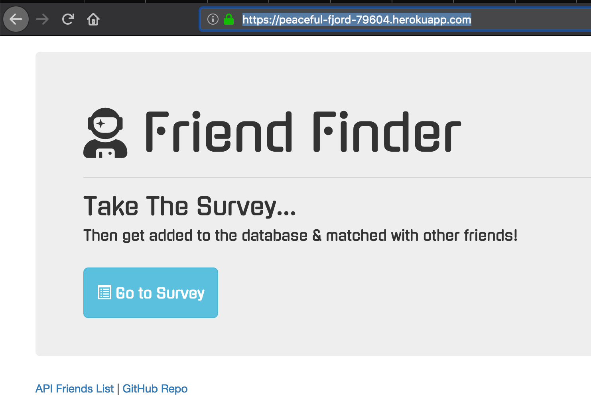

# friendfinder
Friend finder is an online app deployed on heroku using node, express and javascript. You can also run it locally with the steps outlined below.

## heroku link
- deployed to heroku: <br>
https://peaceful-fjord-79604.herokuapp.com/
  

<br>

## Local Setup
- Navigate in your console to desired directory 
- run ```git clone https://github.com/msesno/friendfinder``` to clone repo
- run ```npm i``` to install node dependencies 
- open command line and type....
```
node server.js
```

Congrats, you can now go to ```http://localhost:8080/``` in your browser and add/find friends! 

<br>

## Using friendfinder
Once open you should follow survey instructions 

- NOTE: on heroku app your submission will be saved for comparison too!

<br>

## Screenshots
<br>
